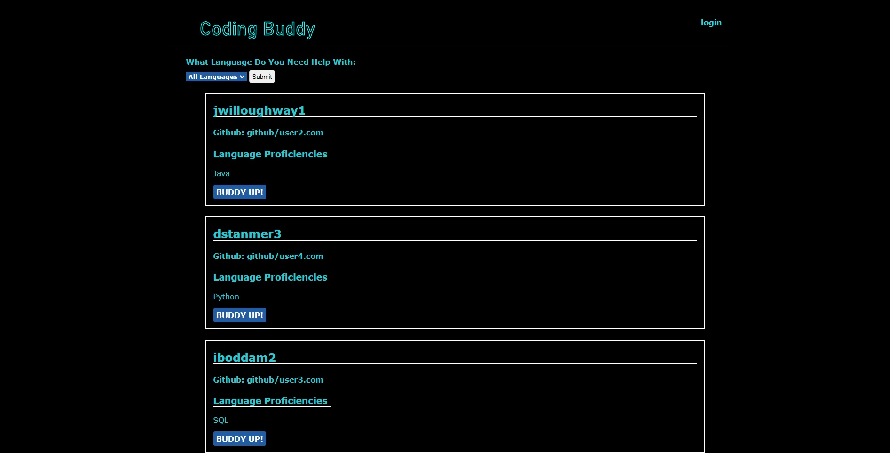

# Coding-Buddy

## description

These days more and more people are trying to learn to code in their own free time and online. This doesnt present many opportunities to collaborate or work with other people.
This applicaiton presents the opportunity to work with other people who might have skills in areas you might be lacking as well as you help them out in areas you might be strong in. In a sense it will link you up with a study buddy. This app will let you put in what you specialize in as well as link your github so any user can look at your past work and see what you might be able to help them with or vice versa.

## Table of Contents

* [Installation](#installation)
* [Usage](#usage)

## Installation

To run this applicaiton locally you will need all of the depencies listed in the package.json. Once you have those installed you must create the database in the mysql shell and then do npm run seeds in the terminal. Once that is done you can just use npm start and open up localhost were you will be able to see the application. If you access the application via the deployed heroku link there is nothing that is needed to be done, just enjoy exploring the application!

## Usage

This application is designed to help you find a study buddy. Once on the homepage you first want to create a account which you can do by clicking the login button at the top right as viewed below. There you will see the sign-up form, once filled out it and you as well have choosen your strongest language, it will take right back to the home page were you can sort out the users using the drop down to search by programming language. Once you found a buddy you'd like to work with and have reviewed their github link, you can hit BUDDY UP! and it will open up your default email application were you can send them a email saying you like their work and want to get some pointers from them! 

For our new library/package we used animejs to add a responsive and animated title on the heading!

In the future we would like to replace the email function with a live chat feature, as well as a more extensive profile feature were you can add a profile picture, bio, and add users to a friend list so you can continue being coding buddys. 

Image of the deployed app 

link to deployed app https://coding-bud.herokuapp.com/
